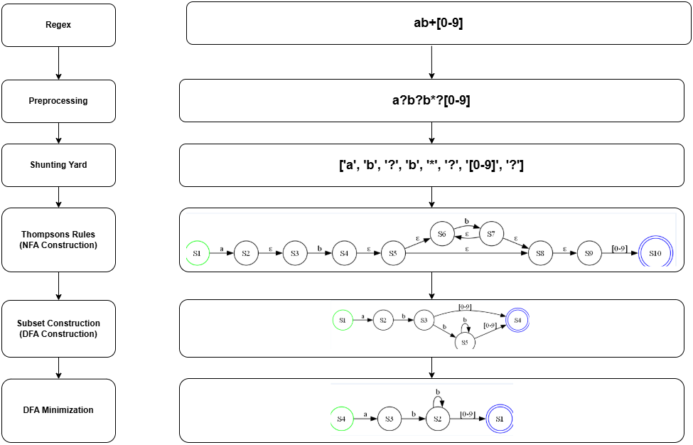

# Regex Compiler 🛠️✨

A complete implementation of a regex compiler that processes regular expressions, constructs automata, and performs DFA minimization. This project is built using multiple algorithms such as Thompson's construction, subset construction, and DFA minimization.

---
### Project Structure
```
Regex-To-minimized-DFA/
├── code/                  # Source code directory
│   ├── Utils.py           # Common functions used in different modules
│   ├── shunting_yard.py   # Shunting-yard algorithm
│   ├── RegexToNFA.py      # Thompson construction implementation
│   ├── NFAToDFA.py        # Subset construction for DFA
│   ├── CustomDataTypes.py # NFA , DFA , States classes defined 
│   ├── MinimizeDFA.py     # DFA minimization module
│   └── main.ipynb         # Testing cell
├── input.txt              # Enter the regex to be read by the program here 
├── workflow.drawio.png    # Diagrams and figures
├── README.md              # Documentation for the project   
└── requirements.pdf       # Project document
```
---
## Input 
- Input regex accepts characters of type alphanumeric only : UpperCase Letters , LowerCase Letters , underscores , numbers and the dot symbol (matches anything).
- Accepted Operators are :
  
> | Operator | Meaning          |
> |----------|------------------|
> | `+`      | One or more      |
> | `*`      | Zero or more     |
> | `?`      | Zero or one      |
> | '\|'      | Logical OR       |
> | `()`     | Grouping         |
> | `[]`     | Character Class  |
---
## Output
- The Program generates Three outputs in case of valid regex  : NFA , DFA , Minimized DFA . Each in two forms : json file and graph.png.
```
code/
├── graphs/
│   ├── dfa.png
│   ├── nfa.png
│   └── minimized_dfa.png
└── json_files/
    ├── dfa.json
    ├── nfa.json
    └── minimized_dfa.json
```

## Modules Summary 🚀

| **Module**                        | **Description**                                                               |
|------------------------------------|-------------------------------------------------------------------------------|
| **Preprocessing Module**           | Ensures proper transformation before applying Shunting Yard algorithm.        |
| **Shunting Yard Module**           | Converts infix regex notation to postfix notation.                            |
| **Thompson's Construction Module** | Creates NFA from postfix regex, allowing efficient regex evaluation.         |
| **Subset Construction Module**     | Converts NFA to DFA using the subset construction algorithm.                             |
| **DFA Minimization Module**        | Optimizes the DFA by reducing redundant states.                              |

---

---
### Modules in Detail

### 1. Preprocessing Module ✂️
The Shunting Yard algorithm expects only specific operands: logical OR (|), concatenation, and zero or more (*). The Preprocessing Module ensures that the user input is transformed into a format compatible with these operands.

For example :
1. the expression a+ is converted to aa* before applying the Shunting Yard algorithm.
2. The expression ab is converted to a?b to handle optional elements.
3. The a? operator (zero or more) is converted to (a|ε) to represent zero or more occurrences of a.
4. Additionally, square brackets [] are treated as a single unit, preserving the grouping of characters inside.


### 2. Shunting Yard Algorithm 🏗️
The algorithm is implemented following [this paper](https://gregorycernera.medium.com/converting-regular-expressions-to-postfix-notation-with-the-shunting-yard-algorithm-63d22ea1cf88)

---

### 3. Thompson's Construction 🤖
The algorithm is implemented following [this paper](https://medium.com/swlh/visualizing-thompsons-construction-algorithm-for-nfas-step-by-step-f92ef378581b)

---

### 4. Subset Construction 🌐
Implements the subset construction algorithm to:
Convert NFAs into equivalent deterministic finite automata (DFAs).

---

### 5. DFA Minimization 🛠️
1) Initial Grouping: Divide the states into two groups based on their type: accepting states and non-accepting states.

2) Input Transition Grouping: Further divide the groups based on the states' transitions. States that share the same transitions (for inputs x, y, z, etc.) belong to the same group.

3) Sorting: Once each group has states with the same inputs, sort the groups for consistency.

4) Subgroup Evaluation: For each subgroup, compare each state’s transitions against every input in that group. Since the states in the same group have identical transitions, they will be evaluated in relation to each input.

5) Key Tuple Creation: For each subgroup, construct a dictionary where the key is a tuple of the destinations' groups for each transition (e.g., for inputs a, b, c). If a state has identical transition groups for all inputs, it belongs to the same minimized group.

6) Final Grouping: After iterating through all the states, each dictionary key-value pair will represent a minimized set of states.
#### Example :
Assume we have a subgroup containing the set of states from 0 to 3 


| State | Transition on `a` | Transition on `b` |
|-------|-------------------|-------------------|
|  s0   |      group2       |      group1       |
|  s1   |      group3       |      group5       |
|  s2   |      group3       |      group4       |
|  s3   |      group3       |      group4       |

The constructed dictionary from the previous subgroup will be as follows :

 
| Key (Transition Groups) | States         |
|-------------------------|----------------|
| (g2, g1)                | s0             |
| (g3, g5)                | s1             |
| (g3, g4)                | [s2, s3]       |

**note that** : key[0] is the first input (in this case a) and key[1] is the second input (in this case b).
**why is this working** ? because we have made a pass that partitioned groups based on its transitions and we sorted the transition so now we are sure that each subgroup have the same input transitions.

7) repeat the process until all groups have stablized 
### Requirements
To run this project, you'll need to install the following dependencies:

- Python 3.x
- [Graphviz](https://graphviz.org/download/) library for viewing the graphs.

